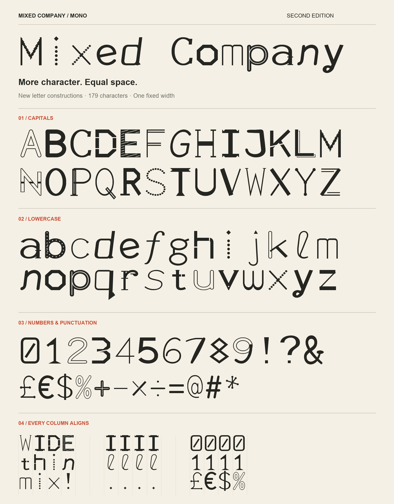

# Mixed Company

Original display fonts with deliberately varied character styles, created for Stuart Alldred.

- **Mixed Company** — the original proportional edition, with rounded, serif, outlined, stencil and handwritten treatments.
- **Mixed Company Mono** — the second edition, with more distinct constructions and a fixed advance width of 640 units in a 1000-unit em. Every supported character, including spaces and punctuation, occupies one column.

Both editions contain 179 encoded characters. They suit headings, posters, invitations and short statements, preferably at 32 pt or larger.

## Fonts and previews

| Edition | Installable font | Offline tester | Complete package |
| --- | --- | --- | --- |
| Original | [TTF](outputs/MixedCompany-Regular.ttf) | [Try text](outputs/MixedCompany-Try-It.html) | [ZIP](outputs/MixedCompany-Font-Package.zip) |
| Mono | [TTF](outputs/MixedCompanyMono/MixedCompanyMono-Regular.ttf) | [Try text](outputs/MixedCompanyMono/MixedCompanyMono-Try-It.html) | [ZIP](outputs/MixedCompanyMono-Package.zip) |

[Compare the original and mono designs](outputs/MixedCompanyMono/MixedCompanyMono-Before-After.png).



Double-click a TTF on macOS and install it in Font Book, then select **Mixed Company** or **Mixed Company Mono** in an app. On Windows, right-click the TTF and choose Install. The HTML testers embed the fonts and can be opened offline without installation. WOFF2 versions are also included alongside the TTFs.

## Repository contents

- `src/` — editable Python scripts containing the vector drawings and font construction logic.
- `outputs/` — both font editions, specimens, complete glyph charts, offline testers and release ZIPs.
- `validation/` — character/style inventories and the recorded mono font validation results.
- `requirements.txt` — dependency versions used to create the fonts.

The Python dependencies and temporary working files are excluded from Git. The `Source` copy inside the mono output folder and the source copies in the ZIPs belong to those saved release packages; edit the canonical builders in `src/`.

## Rebuild

The scripts were run with Python 3.12. From the repository root:

```sh
python3 -m venv .venv
source .venv/bin/activate
python -m pip install -r requirements.txt
python src/build_font.py
python src/build_mono.py
```

Build the original first so the mono builder can produce the before-and-after image. The builders regenerate the TTF, WOFF2, PNG and HTML files in `outputs/`, and write reports and extracted tester scripts into the ignored `work/` folder. Release ZIPs and the reports in `validation/` are saved snapshots; the builders do not refresh those snapshots.

The fonts use original vector drawings rather than existing font outlines. The specimen annotations use macOS Arial files; adjust the `ui` and `uib` font paths in the scripts when rebuilding on another platform. The finished fonts do not depend on those annotation fonts.

## Coverage and validation

Coverage includes printable ASCII, common precomposed Latin accents, selected currencies, punctuation, mathematical symbols and arrows. The complete glyph charts show the supported set. Accented letters inherit their base character's treatment. Combining accent sequences and full Unicode coverage are not implemented. Repeated occurrences retain their assigned design.

The mono edition preserves the original character coverage and has fixed-pitch metadata, identical 640-unit advances, and no kerning or substitution tables. Every visible mono glyph rendered at 32 and 96 pixels; glyph bounds, checksums and table compilation passed. At a font size of 100 pixels, `iiii`, `WWWW`, `....`, four spaces, `0000`, `1111`, `AVTo`, `£€$%` and `Àéñü` each measured 256 pixels.

The offline tester scripts passed JavaScript syntax checks. Browser interaction was not verified because the available browser blocked local-file navigation.
