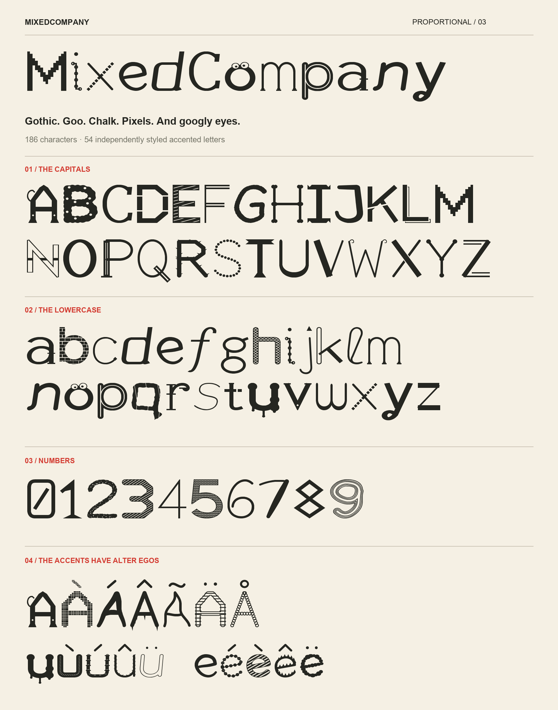

# MixedCompany

One exuberant design, available in two spacing versions:

- **MixedCompany** — standard, proportional spacing with kerning.
- **MixedCompany Mono** — a fixed 640-unit advance for every character.

Both use the latest wild drawings: gothic, pixels, handwriting, chalk, goo, bones, woven strokes and more. Lowercase **o** has googly eyes. All 54 accented letters have independently styled bodies.

## Downloads

| Font | Installable | Web |
| --- | --- | --- |
| MixedCompany | [TTF](outputs/MixedCompany/MixedCompany-Regular.ttf) | [WOFF2](outputs/MixedCompany/MixedCompany-Regular.woff2) |
| MixedCompany Mono | [TTF](outputs/MixedCompanyMono/MixedCompanyMono-Regular.ttf) | [WOFF2](outputs/MixedCompanyMono/MixedCompanyMono-Regular.woff2) |

[Complete package](outputs/MixedCompany-Package.zip) · [Offline tester](outputs/MixedCompany-Try-It.html) · [Spacing comparison](outputs/MixedCompany-Spacing-Comparison.png) · [Character atlas](outputs/MixedCompany-Character-Atlas.png) · [Accent families](outputs/MixedCompany-Accent-Families.png)



Install the TTF files in your operating system, then select MixedCompany or MixedCompany Mono. The tester embeds both fonts for offline use. These fonts replace the earlier designs; previous releases remain in Git history. “Wild Company” is not a separate family.

## Programming symbols

Both fonts include 16 common ligatures:

```
<=  >=  !=  ==  ===  !==
<-  ->  <->  =>  <=>
<--  -->  <==  ==>  ~=
```

Enable standard/common ligatures in your application to join these sequences visually. The underlying text stays the same. Mono preserves the input column count: two characters occupy 1280 units, three occupy 1920 units. Disable the OpenType liga feature to show the individual characters again. Applications without ligature support display the original sequence.

Directly insertable symbols include ≤ ≥ ≠ ← → and the new ↔ ⇐ ⇒ ⇔ ≡ ≢ ≈. Each directly inserted symbol occupies one Mono column.

[Standard ligature proof](outputs/MixedCompany/MixedCompany-Ligatures.png) · [Mono ligature proof](outputs/MixedCompanyMono/MixedCompanyMono-Ligatures.png)

## Rebuild

Using Python 3.12. Validation and ligature proofs also require the HarfBuzz command-line tools (hb-shape and hb-view) on PATH:

```sh
python3 -m venv .venv
source .venv/bin/activate
python -m pip install -r requirements.txt
python src/build_fonts.py
python src/validate_fonts.py
python src/preview_ligatures.py
```

The builder regenerates both fonts, previews and the tester in outputs/. Reports and extracted tester JavaScript go in work/. The release ZIP and validation/ reports are saved snapshots.

The original vector drawings live in src/build_fonts.py. No existing font outlines are used. Preview annotations use macOS Arial; adjust the ui and uib paths for other platforms.

## Coverage and validation

Both versions contain 186 encoded characters, including printable ASCII, 54 precomposed Latin accents and selected punctuation, currencies, maths symbols and arrows. Combining accent sequences and full Unicode coverage are not implemented. Repeated occurrences retain their assigned design. Fine textures work best at display sizes.

Validation checks family names, matching character coverage, checksums, table compilation, glyph bounds and rendering at 48 and 128 pixels. Mono has fixed-pitch metadata, identical 640-unit advances and no kerning; ligatures span exactly two or three columns. Standard has variable advances and kerning. All 54 accented bodies are compared with their parents independently of their accent marks.

HarfBuzz shaping checks every ligature, longest-match sequences, adjacent letters, disabled ligatures, separated operators and unchanged advances. Both proof sheets render the finished fonts through HarfBuzz. TTF and WOFF2 substitution tables match.

Tester JavaScript syntax is checked. Browser interaction was not verified because the browser blocked local-file navigation.
